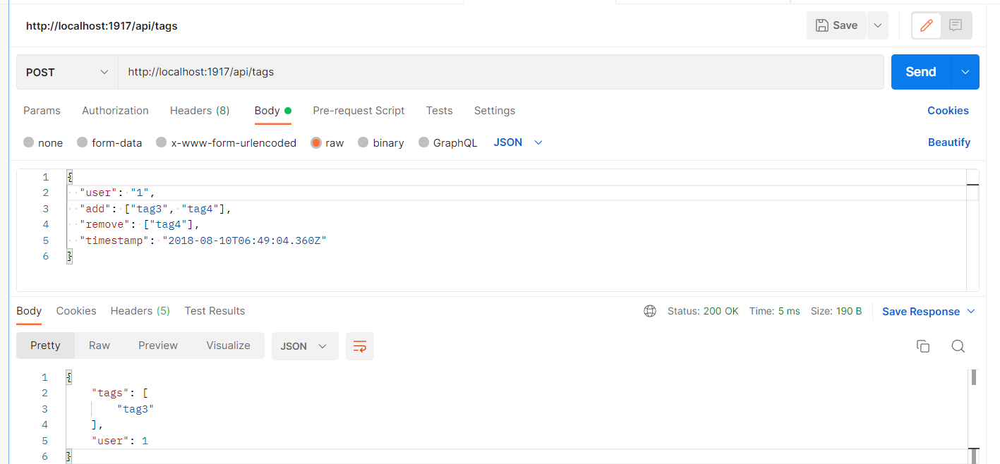

# SpringBoot API

## Tag tracking user API

This API provides an endpoint to create and update user's tags.

* I tested it using Postman :

* Few tests are implemented :
    * one checks the case when we have duplicate tags in add and remove fields.
    * another to check the enpoint code status.
    * the last one to test the error status code when a request can't be parsed.

